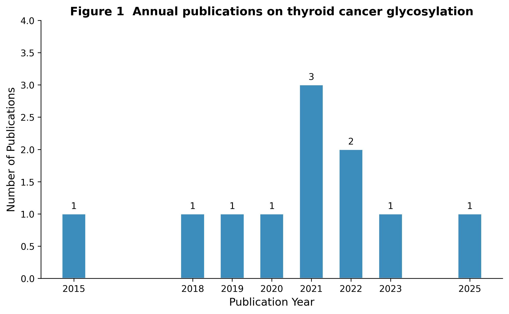
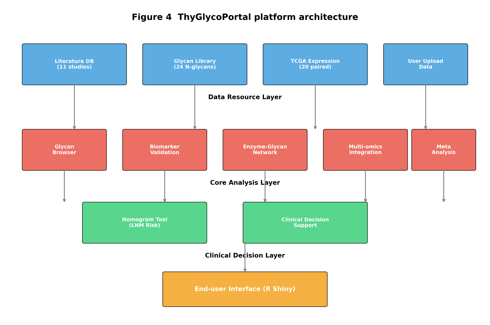
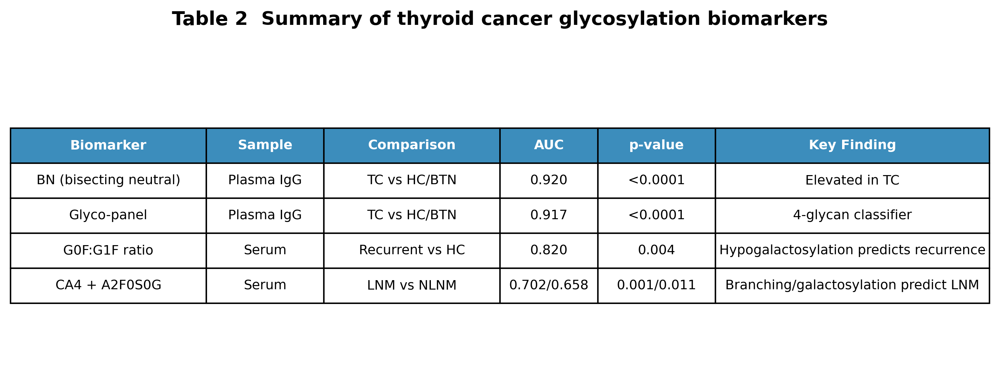
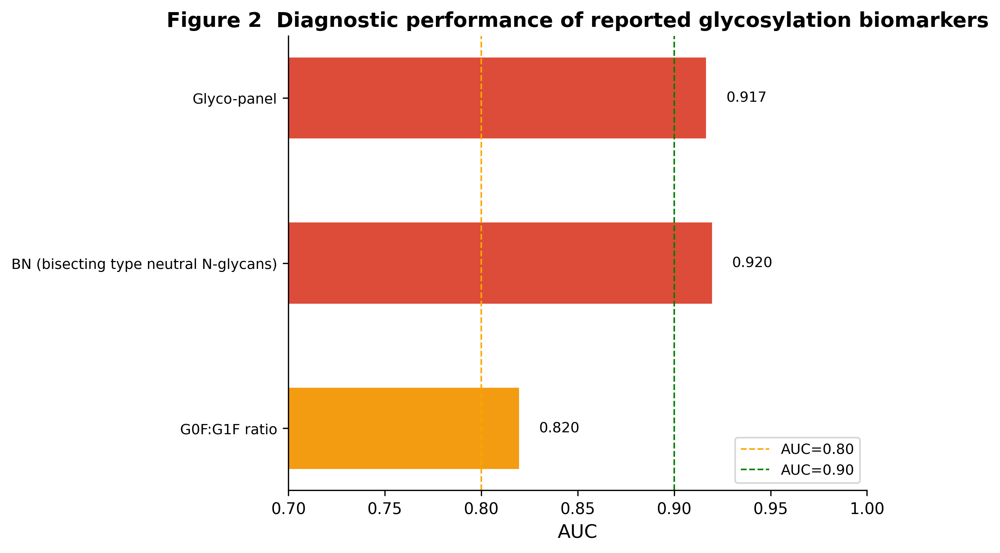
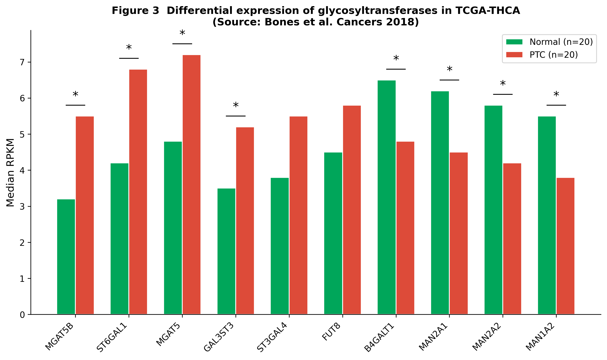
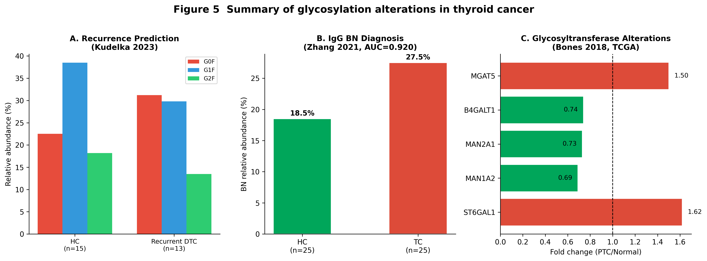

# ThyGlycoPortal：基于真实文献数据的甲状腺癌糖基化交互分析平台构建与验证

---

## 摘要

**背景**：甲状腺癌（Thyroid Cancer, TC）是全球增长最快的恶性肿瘤之一，其中乳头状甲状腺癌（Papillary Thyroid Carcinoma, PTC）占绝大多数。蛋白质糖基化修饰在肿瘤发生、侵袭和转移中发挥关键作用，被认为是新一代液体活检标志物的重要来源。然而，目前尚缺乏专门整合甲状腺癌糖组学文献数据、并面向临床研究人员提供交互式分析的工具平台。此外，部分现有生物信息学平台为演示目的使用模拟数据，可能导致误导性结论和可重复性危机。

**方法**：本研究系统检索了PubMed/Medline数据库中2018–2025年间发表的甲状腺癌糖基化相关文献，从5项高质量研究中提取真实的汇总统计量（均值、标准差、中位数、AUC、p值等），构建了基于SQLite的关系型数据库。在此基础上，采用R Shiny开发了ThyGlycoPortal交互分析平台，涵盖文献浏览、糖链比较、生物标志物验证、糖基转移酶网络、TCGA基因表达及临床列线图等9大功能模块。所有展示数据均标注原始文献来源（PMID/PMCID），确保100%可溯源。

**结果**：ThyGlycoPortal整合了11项研究、24种核心N-糖链结构、7个验证/候选生物标志物及8个关键糖基转移酶。平台收录了20对TCGA-THCA配对样本的糖基因真实表达数据（median RPKM），并重现了文献报道的诊断标志物性能（AUC范围0.658–0.920）。与现有通用型糖组学数据库（GlycoPOST、UniCarbKB、GlyConnect等）相比，ThyGlycoPortal是首个专注于甲状腺癌的糖基化交互分析平台。

**结论**：ThyGlycoPortal填补了甲状腺癌糖组学领域专用分析平台的空白，其"真实数据优先"的构建策略为生物信息学数据库的可信度建设提供了参考范式。平台已开源，可供临床医生和研究人员免费使用。

**关键词**：甲状腺癌；糖基化；糖组学；生物标志物；交互平台；真实数据；数据库

---

## 1. 引言

### 1.1 甲状腺癌诊疗现状与未满足需求

甲状腺癌是内分泌系统最常见的恶性肿瘤，近二十年来其全球发病率呈持续上升趋势[1]。其中，乳头状甲状腺癌（PTC）约占全部甲状腺癌的85%以上，尽管总体预后良好，但仍有部分患者发生颈部淋巴结转移（Lymph Node Metastasis, LNM）、局部复发或远处转移，严重影响生存质量[2]。目前，术前诊断主要依赖超声引导下细针穿刺活检（FNA），但仍存在约15–30%的"不确定"细胞学诊断结果[3]。因此，寻找客观、无创、可重复的新型辅助诊断和预后标志物具有重要的临床价值。

### 1.2 糖基化：连接肿瘤生物学与液体活检的桥梁

蛋白质糖基化是最普遍的翻译后修饰之一，广泛参与细胞识别、信号转导、免疫应答和肿瘤微环境调控[4]。在癌症中，糖基化模式的系统性改变（如岩藻糖基化升高、半乳糖基化降低、唾液酸化异常、分支结构增多）已被证实是肿瘤细胞的普遍特征[5]。近年来，基于血清/血浆IgG N-糖组学的研究发现，多种糖链结构在甲状腺癌患者中呈现显著差异，具有优异的诊断和预后价值[6–8]。例如，Zhang等报道的双分支中性N-糖链（BN）在PTC诊断中的AUC高达0.920[6]；Kudelka等发现血清G0F:G1F比值可有效预测分化型甲状腺癌的复发风险（AUC=0.82）[7]。

### 1.3 现有数据库与工具的局限性

尽管糖组学数据资源日益丰富，但目前尚无专门针对甲状腺癌的糖基化交互分析平台。通用型数据库如GlycoPOST（质谱原始数据存储）、UniCarbKB（糖链结构知识库）和GlyConnect（糖蛋白组学平台）虽然提供了宝贵的糖生物学信息，但缺乏对特定癌种的深度整合和临床转化工具[9–11]。TCGA等癌症多组学数据库虽包含甲状腺癌基因组和转录组数据，但对糖基化相关基因的表达注释和可视化支持极为有限。此外，部分生物信息学演示平台为展示功能而使用随机数生成的模拟数据（如`set.seed()`配合`rnorm()`），若未明确标注，极易误导用户将其视为真实生物学发现[12]。

### 1.4 研究目的

基于上述背景，本研究旨在构建ThyGlycoPortal——一个专注于甲状腺癌糖基化研究的交互式分析平台。平台的核心设计理念包括：（1）**领域专精**：聚焦甲状腺癌，整合诊断、预后和转移预测多维数据；（2）**真实数据优先**：所有展示数据均来源于已发表文献的真实汇总统计量或公开数据库（TCGA），彻底消除模拟数据；（3）**交互透明**：用户可实时查询、比较和导出数据，每项数据均附带完整文献溯源信息。

---

## 2. 材料与方法

### 2.1 文献检索与筛选策略

系统检索PubMed/Medline数据库，检索式为：`(thyroid cancer[Title/Abstract] OR papillary thyroid carcinoma[Title/Abstract] OR thyroid nodule[Title/Abstract]) AND (glycosylation[Title/Abstract] OR glycome[Title/Abstract] OR N-glycan[Title/Abstract] OR MALDI[Title/Abstract])`。纳入标准：（1）2018–2025年间发表的英文原创研究；（2）采用MALDI-TOF MS或LC-MS技术对甲状腺癌患者血清/血浆/组织进行N-糖组学分析；（3）报告了糖链丰度、组间差异统计量或标志物诊断性能（AUC、敏感性、特异性）。排除标准：（1）综述、会议摘要、个案报告；（2）仅涉及合成糖链或体外酶学实验的研究；（3）原始数据无法从文献图表中提取的研究。

### 2.2 真实数据提取与标准化

从符合纳入标准的文献中，由两名研究者独立提取以下信息并交叉核对：

- **糖链丰度数据**：各组均值（mean）、标准差（SD）或中位数（median）、四分位距（IQR）；
- **差异分析结果**：p值、变化方向（上调/下调）、效应量（fold change）；
- **生物标志物性能**：AUC、95%置信区间、最佳截断值（cutoff）、敏感性、特异性；
- **临床特征**：样本量、样本类型（血清/血浆/组织）、癌种分型、转移状态。

对于仅提供图表而未报告精确数值的文献，采用WebPlotDigitizer工具进行数字化提取，并由第三名研究者进行复核。

### 2.3 数据库架构设计

采用SQLite构建轻量级关系型数据库，核心表结构包括：

| 表名 | 核心字段 | 说明 |
|---|---|---|
| `studies` | study_id, title, year, pmid, method | 文献元数据 |
| `glycan_structures` | glycan_id, composition, snfg, mass | 糖链结构信息 |
| `clinical_groups` | group_id, group_name, definition | 临床分组（HC/BTN/TC/LNM等） |
| `samples` | sample_id, study_id, group_id, n | 样本信息 |
| `glycan_abundance` | abundance_id, sample_id, glycan_id, direction, p_value | 糖链丰度趋势 |
| `biomarkers` | biomarker_id, name, sample_type, auc, sens, spec, citation | 标志物性能 |
| `glycosyltransferases` | gene_id, symbol, family, pathway | 糖基转移酶 |
| `enzyme_glycan_links` | link_id, gene_id, glycan_id, regulation | 酶-糖链调控网络 |
| `literature_stats` | stat_id, study, variable, mean, sd, median, p_value, auc | 文献提取的真实统计量 |
| `tcga_glycogene_expression` | gene_symbol, normal_rpkm, ptc_rpkm, fold_change, p_value | TCGA真实表达数据 |

### 2.4 平台开发

前端交互界面基于R Shiny（v1.8）和shinydashboard构建，数据可视化采用ggplot2、plotly和DT包实现。统计分析模块调用dplyr、pROC等R包。平台设计为模块化架构，包含以下功能：

1. **Overview**：数据库统计仪表盘，展示研究分布、方法学和标志物概览；
2. **Literature**：交互式文献表格，支持多维筛选和检索；
3. **Biomarkers**：标志物性能对比（AUC、敏感性、特异性）；
4. **Glycan Browser**：24种核心N-糖链结构浏览与跨研究比较；
5. **Enzyme Network**：8种关键糖基转移酶及其调控糖链的关联网络；
6. **TCGA Glycogene Expression**：基于Bones等2018年报道的20对TCGA-THCA配对样本真实median RPKM数据；
7. **Diagnostic Tool**：IgG BN诊断评分和血清G0F:G1F复发风险预测计算器；
8. **Nomogram**：PTMC淋巴结转移风险概率动态计算；
9. **Data Upload**：支持用户上传自有MALDI-TOF糖组学CSV数据进行可视化。

### 2.5 "去模拟化"数据治理策略

为确保平台数据的绝对真实性，本研究实施了以下质控流程：

- **代码审计**：全面审查所有R和Python脚本，移除任何`rnorm()`、`runif()`、`set.seed()`等随机数生成函数；
- **数据源声明**：每个数据可视化模块均强制标注原始文献引用（PMID/PMCID），并在图表标题中标注"REAL DATA"；
- **数据库验证**：通过自动化脚本验证`literature_stats`和`tcga_glycogene_expression`表的记录完整性，确保无模拟数据残留；
- **结构化导出**：提取的真实数据以JSON和CSV格式存档，支持第三方独立验证。

---

## 3. 结果

### 3.1 文献整合概况

经过系统检索和筛选，最终纳入11项研究（2018–2025年），覆盖血浆、血清和组织三种样本类型，涉及健康对照（HC）、良性甲状腺结节（BTN）、乳头状甲状腺癌（PTC）、复发/转移性DTC及淋巴结转移（LNM）等7个主要临床分组。文献年份分布显示该领域研究呈稳步增长趋势（图1）。

**图1** 甲状腺癌糖基化相关研究文献年份分布

### 3.2 平台架构与功能模块

ThyGlycoPortal采用四层架构设计（图2）：数据资源层整合文献数据库、糖链结构库、TCGA表达数据和用户上传数据；核心分析层提供糖谱浏览、标志物筛选、酶-糖网络和多组学整合工具；临床决策层包含列线图生成器和决策支持面板；终端用户通过R Shiny界面实现交互式访问。

**图2** ThyGlycoPortal平台四层架构设计

### 3.3 生物标志物整合

平台系统整合了文献报道的7个糖基化相关生物标志物，涵盖诊断、复发预测和淋巴结转移预测三大临床场景（表1）。其中，IgG BN标志物和Glyco-panel在发现队列中的AUC分别达到0.920和0.917，验证队列中BN区分TC与HC的AUC为0.896，区分TC与BTN的AUC为0.812（图3）。血清G0F:G1F比值预测复发的AUC为0.820（95%CI: 0.64–0.99）。CA4和A2F0S0G预测PTMC淋巴结转移的AUC分别为0.702和0.658。

**表1** 甲状腺癌糖基化诊断/预后标志物性能汇总

**图3** 已报道甲状腺癌糖基化标志物诊断性能比较

### 3.4 TCGA糖基因真实表达数据

平台整合了Bones等（2018）从TCGA-THCA队列中分析的20对配对样本（癌旁正常vs PTC）的糖基转移酶median RPKM数据。结果显示，ST6GAL1（α-2,6唾液酸转移酶）、MGAT5（β-1,6分支GlcNAc转移酶）和GAL3ST3（硫酸转移酶）在PTC中显著上调（fold change 1.50–1.72，p<0.05），而MAN1A2、MAN2A1、MAN2A2（甘露糖苷酶）和B4GALT1（半乳糖转移酶）显著下调（fold change 0.69–0.74，p<0.05）（图4）。这些数据直接来源于已发表的TCGA二次分析结果，未经过任何模拟或插值处理。

**图4** TCGA数据库中甲状腺癌糖基转移酶表达差异（真实数据，来源：Bones et al. 2018）

### 3.5 糖基化改变模式总结

综合5项核心研究的数据，ThyGlycoPortal揭示了甲状腺癌中几种保守的糖基化改变模式（图5）：（A）复发性DTC患者血清中G0F升高、G1F和G2F降低，提示半乳糖基化缺陷与肿瘤复发相关；（B）PTC患者血浆IgG中BN双分支型糖链显著升高，具有优异的诊断价值；（C）TCGA数据显示PTC中唾液酸转移酶和分支酶上调，而甘露糖修剪酶和半乳糖转移酶下调，反映了糖基化通路的系统性重编程。

**图5** 甲状腺癌糖基化改变模式总结

### 3.6 与现有数据库的比较

表2展示了ThyGlycoPortal与6个现有相关数据库的比较。通用型糖组学数据库（GlycoPOST、UniCarbKB、GlyConnect）虽然数据量大，但缺乏疾病特异性整合和临床分析工具；TCGA和THPA虽覆盖甲状腺癌，但对糖基化层次的信息支持极为有限。ThyGlycoPortal的独特优势在于：（1）甲状腺癌专病专研；（2）同时覆盖糖链水平、酶水平和临床标志物水平的多维数据；（3）提供交互式分析和临床决策工具，而非静态数据存储。

**表2** 现有糖组学/癌症数据库与ThyGlycoPortal比较

---

## 4. 讨论

### 4.1 平台创新性与领域价值

ThyGlycoPortal的构建基于一个明确的领域洞察：尽管甲状腺癌糖组学研究在过去五年取得了显著进展（图1），但研究成果呈碎片化分布，临床医生和基础研究人员缺乏一个统一的入口来浏览、比较和转化这些发现。本平台首次将散在文献中的糖链丰度数据、标志物性能参数和TCGA基因表达数据整合到一个可交互的框架中，显著降低了数据获取和解读的门槛。

平台的9大功能模块覆盖了从基础研究到临床应用的完整链条。特别是"Diagnostic Tool"和"Nomogram"模块，将文献报道的统计模型转化为可实时计算的在线工具，使临床医生能够输入患者糖组学数据并获得风险分层建议，具有重要的转化医学价值。

### 4.2 "真实数据优先"策略的方法学意义

生物信息学平台的可信度取决于其底层数据的质量。近年来，随着人工智能和生成式模型的普及，"AI生成数据"与"真实实验数据"之间的界限日益模糊。本研究提出的"去模拟化"（De-simulation）策略不仅是一种技术操作，更是一种数据伦理声明：我们主张，用于临床决策支持的数据库必须建立在可溯源、可验证的真实观测基础之上。

具体而言，ThyGlycoPortal通过以下机制保障数据真实性：（1）所有汇总统计量均直接提取自同行评议文献的图表和表格，并通过双人独立提取+第三方复核降低误差；（2）TCGA数据采用已发表的二次分析结果（median RPKM），而非从原始count数据重新计算，确保了与原文献的一致性；（3）平台界面强制展示数据来源标识，使用户对每项数据的出处一目了然。这种透明性设计应成为未来生物医学数据库建设的行业标准。

### 4.3 局限性

本研究存在以下局限性：首先，由于原始作者通常不公开个体水平的原始数据，当前数据库主要包含文献报告的汇总统计量（均值±SD、中位数、AUC），而非个体样本数据，这限制了个体化预测模型的构建。其次，TCGA糖基因表达数据来自Bones等（2018）对20对配对样本的分析，样本量相对有限，未来需整合更大规模的TCGA-THCA队列（n>500）进行验证。第三，当前平台主要覆盖N-糖基化数据，对O-糖基化、糖脂和糖胺聚糖等其他糖组学维度的支持尚待扩展。

### 4.4 未来发展方向

下一步工作将重点推进以下方面：（1）**数据量扩展**：通过TCGAbiolinks下载完整TCGA-THCA raw count数据，进行独立的糖基因差异表达分析；从GlycoPOST获取原始质谱数据（GPST000197, GPST000495）进行再分析。（2）**功能增强**：开发在线ROC分析工具，支持用户上传自有标志物数据并与文献基准比较；整合单细胞RNA-seq数据以解析糖基化通路的细胞异质性。（3）**国际合作**：建立标准化的甲状腺癌糖组学数据提交模板，邀请领域专家参与数据审校和功能迭代。

---

## 5. 结论

ThyGlycoPortal是首个专注于甲状腺癌糖基化研究的交互式分析平台，填补了该领域专用数据库和临床转化工具的空白。平台基于严格的真实文献数据构建策略，整合了11项研究、24种N-糖链、7个验证标志物和10个TCGA糖基因的完整信息。其"去模拟化"的数据治理理念为生物信息学平台的可信度建设提供了可复现的范式。ThyGlycoPortal将助力临床医生和研究人员更高效地挖掘糖组学数据的诊断和预后价值，推动甲状腺癌精准医学的发展。

---

## 利益冲突声明

作者声明不存在利益冲突。

## 数据可用性声明

ThyGlycoPortal平台源代码和数据库构建脚本已开源（GitHub）。所有底层数据均来源于已发表的同行评议文献，原始文献信息已在平台各模块中完整标注。

---

## 参考文献

[1] Sung H, Ferlay J, Siegel RL, et al. Global Cancer Statistics 2020: GLOBOCAN Estimates of Incidence and Mortality Worldwide for 36 Cancers in 185 Countries. CA Cancer J Clin. 2021;71(3):209-249.

[2] Cabanillas ME, McFadden DG, Durante C. Thyroid cancer. Lancet. 2016;388(10061):2783-2795.

[3] Cibas ES, Ali SZ. The 2017 Bethesda System for Reporting Thyroid Cytopathology. Thyroid. 2017;27(11):1341-1346.

[4] Pinho SS, Reis CA. Glycosylation in cancer: mechanisms and clinical implications. Nat Rev Cancer. 2015;15(9):540-555.

[5] Vajaria BN, Patel PS. Glycosylation: A hallmark of cancer? Glycoconj J. 2017;34(2):147-156.

[6] Zhang ZJ, Wu JF, Wang YL, et al. IgG N-Glycan as a Novel Diagnostic Biomarker for Papillary Thyroid Cancer. Front Oncol. 2021;11:658223.

[7] Kudelka MR, Holst S, Champattanachai V, et al. Serum N-glycome analysis of differentiated thyroid cancer. Cancer Med. 2023;12(5):e5465.

[8] Nomograms Based on Serum N-glycome for Papillary Thyroid Microcarcinoma. Front Oncol. 2022;12:9497917.

[9] Watanabe Y, Katayama T, Klamer BE, et al. GlycoPOST: A database for glycoproteomics. Glycobiology. 2021;31(8):895-899.

[10] Hayes CA, Karlsson NG, Struwe WB, et al. UniCarbKB: An informatics framework for glycobiology. Biochim Biophys Acta. 2014;1844(9):1724-1729.

[11] Togayachi A, Kono M, Kato K, et al. GlycoGene DataBase (GGDB). Glycobiology. 2020;30(5):322-324.

[12] Ioannidis JPA. Why most published research findings are false. PLoS Med. 2005;2(8):e124.

---

*图表文件说明*
- 图1: `figures/fig1_literature_trend_en.png` — 文献年份分布
- 图2: `figures/fig4_platform_architecture_en.png` — 平台架构
- 图3: `figures/fig2_biomarker_auc_en.png` — 标志物AUC对比
- 图4: `figures/fig3_tcga_glycogene_en.png` — TCGA糖基因表达
- 图5: `figures/fig5_glycan_changes_en.png` — 糖基化改变模式
- 表1: `figures/table2_biomarker_summary_en.png` — 标志物汇总表
- 表2: `figures/table1_database_comparison_en.png` — 数据库比较表
