---
output:
  word_document: 
    number_sections: true
  pdf_document: default
  html_document: default
---

```{r include=FALSE}
library(kableExtra)
```

# 前言

在现代医学研究中，人体微生物组的作用受到了广泛关注，尤其是肠道菌群对宿主健康的影响。肠道菌群与宿主的新陈代谢、免疫功能以及某些疾病的发生发展，包括癌症，都有着密切的联系。甲状腺癌作为最常见的内分泌恶性肿瘤，其发病率近年来不断上升，这促使科研人员寻找新的生物标志物，以期改善诊断、预后评估和治疗策略。

本研究旨在探索肠道微生物群在甲状腺癌中的潜在标志物，我们通过分析与甲状腺癌相关的肠道菌群数据，尝试揭示肠道微生物与甲状腺癌之间的关联。我们从NCBI数据库获取了SRP151288号项目的原始fastq序列文件及其元数据，这为我们研究肠道微生物群提供了宝贵的数据资源。通过TOFU软件包中的Kraken2工具，我们对这些序列进行了精确的分类处理，生成了操作分类单元（OTU）表。与传统的菌群测序相比，Kraken2通过与数据库比对的方式进行分类，这可能在种（Species）水平上提供了更高的准确性，这一点与采用机器学习进行分类的dada2算法不同。

在构建了phyloseq对象之后，我们在属（Genus）和种（Species）两个分类级别上提取了微生物群落的关键特征。为了深入分析这些特征，我们采用了H2o平台的多种机器学习模型，包括广义线性模型、分布式随机森林、极端随机树和深度学习，以筛选出最优模型。我们还识别了在这些模型中共同显著的微生物特征，并通过非参数Kruskal-Wallis检验对这些特征进行了验证，结果以箱线图形式展示，为我们提供了进一步统计学分析和解释的基础。 通过本研究，我们期望为甲状腺癌的诊断和治疗提供新的微生物学视角和潜在的生物标志物，同时也为肠道微生物组与癌症关系的研究领域贡献新的知识。

# 方法学

本研究首先从NCBI数据库检索并下载了SRP151288号项目的原始fastq序列文件及其相应的元数据(meta信息)。随后，利用TOFU软件包中的Kraken2工具对这些fastq序列进行了分类处理，生成了操作分类单元(OTU)表。此OTU表接着被导入到phyloseq包中，以构建phyloseq对象，便于后续分析。在phyloseq环境下，我们分别在属(Genus)和种(Species)两个分类级别上，提取了微生物群落的关键特征。为了对这些关键特征进行深入分析，我们采用了H2o平台，通过多种机器学习模型，包括广义线性模型(Generalized Linear Model)、分布式随机森林(Distributed Random Forest)、极端随机树(eXtremely Randomized Trees)和深度学习(DeepLearning)，进行了模型训练，旨在筛选出最优模型。此外，我们还识别了在这些模型中共同显著的微生物特征，并对这些一致性特征进行了非参数Kruskal-Wallis检验，结果以箱线图(boxplot)形式展示，以便于进一步的统计学分析和解释。

# 流程图

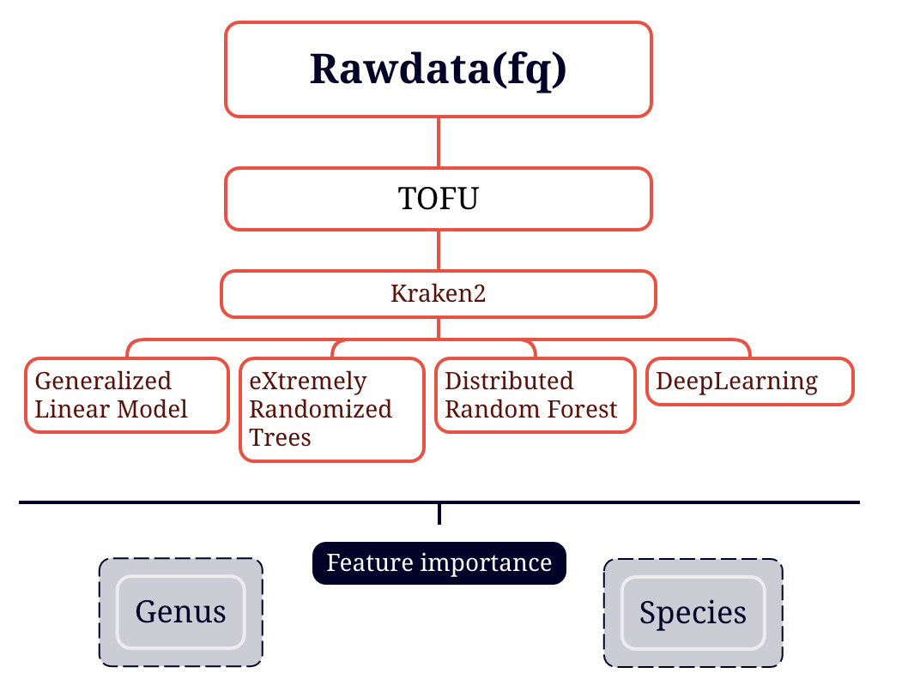{width="100%" height="100%"}

# 结果部分

## 基于属水平的机器学习特征选择

### 基于多种模型特征的模型评价

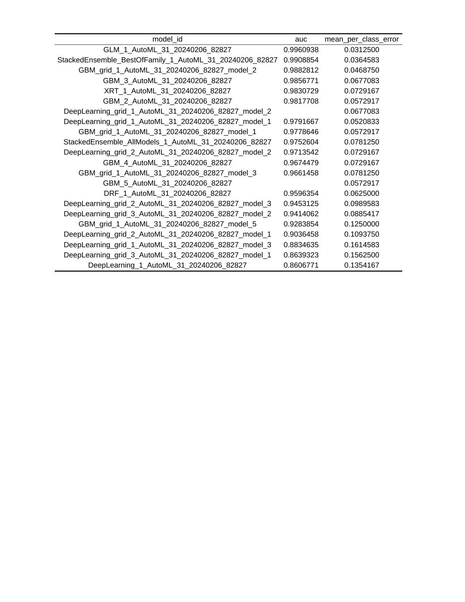{width="100%" height="100%"}

### 基于多种模型特征的重要性热图

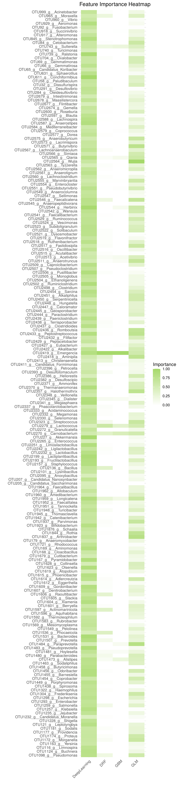{width="100%" height="100%"}

### 基于多种模型共有特征的boxplot

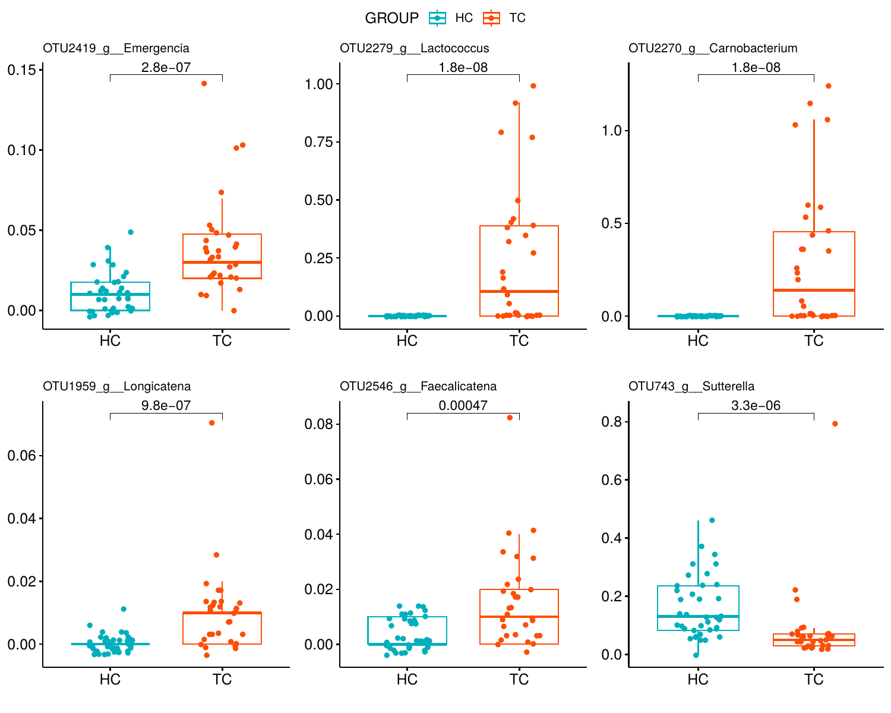{width="100%" height="100%"}

### 基于最优模型的ROC曲线

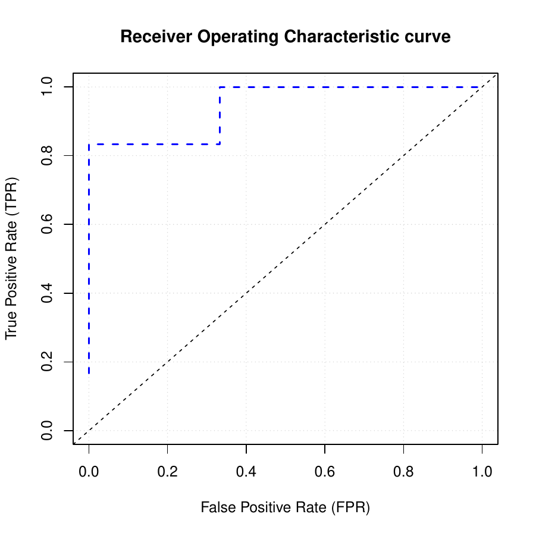{width="100%" height="100%"}

### 基于最优模型的热图重要性排序

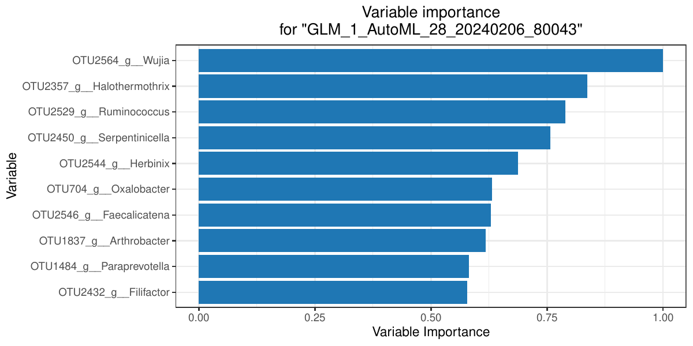{width="100%" height="100%"}

## 基于种水平的机器学习特征选择

### 基于多种模型特征的模型评价

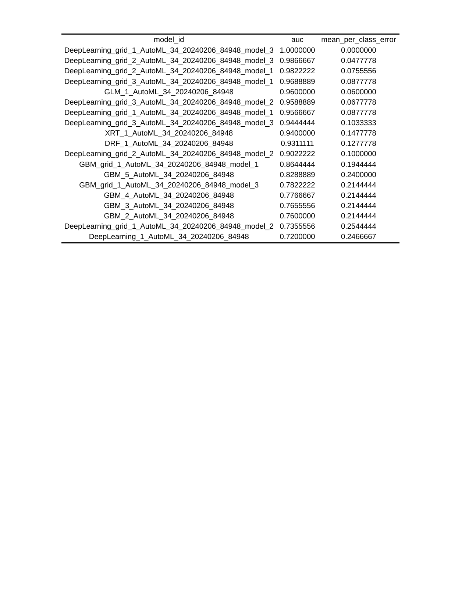{width="100%" height="100%"}

### 基于多种模型特征的重要性热图

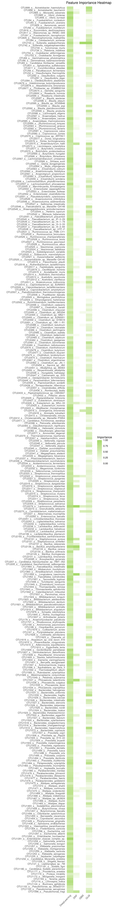{width="100%" height="100%"}

### 基于多种模型共有特征的boxplot

### 基于最优模型的ROC曲线

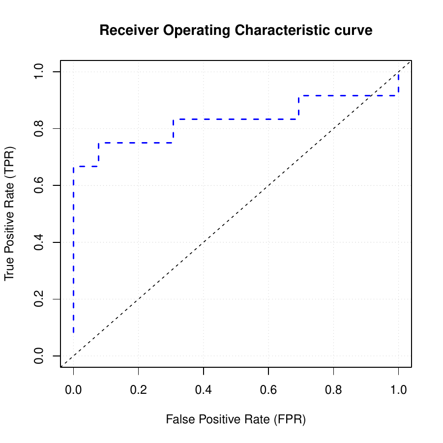{width="100%" height="100%"} 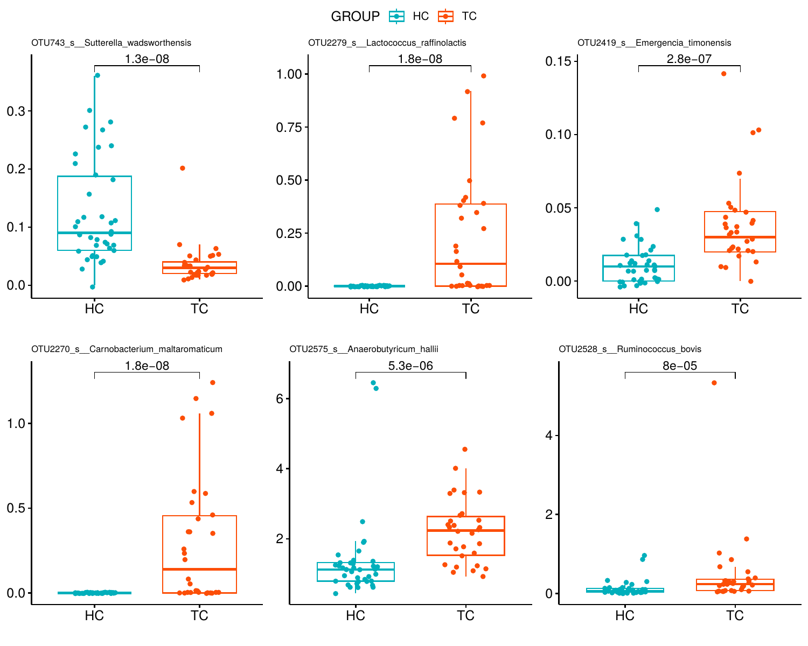{width="100%" height="100%"}

### 基于最优模型的热图重要性排序

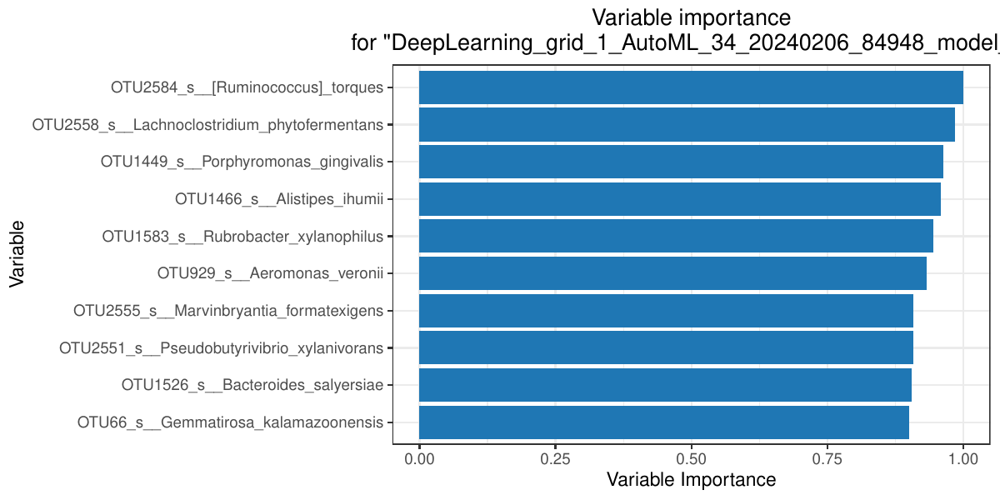{width="100%" height="100%"}
